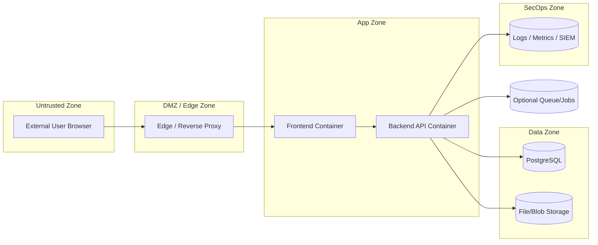

# DevOps Implementation Plan (Final)

## Project
Secure Healthcare Information & Patient Management System

## Audience
DevOps Engineering, Platform Engineering, Security Engineering, Compliance, Release Management

## Goal
Implement a production-grade DevOps program for a healthcare system aligned with GDPR/HIPAA engineering expectations, with measurable maturity and audit-ready operational evidence.

---

## Guiding Principles

- Controls are **risk-driven**, not tool-driven.
- Assume **internal compromise is possible** (Zero Trust posture).
- Prefer **preventive controls** first, detective controls second, reactive controls third.
- Every control must be verifiable through CI/CD evidence, logs, or runbooks.
- Release safety uses **policy-as-code**, not human memory.

---

## Current Baseline

Already available in repo:
- `docker-compose.yaml`
- Containerized backend/frontend
- Basic CI workflows (`backend-ci.yml`, `frontend-ci.yml`)
- Backend test baseline passing

Primary gaps:
- Threat model not formalized
- Runtime security policy underdefined
- Secret lifecycle governance not explicit
- Zero Trust architecture controls incomplete
- Security observability not formalized
- Data lifecycle governance incomplete for GDPR/HIPAA outcomes
- Deployment policy gate not codified
- Migration compatibility contract not defined
- Access recertification cadence missing
- No measurable readiness scorecard

---

## Phase 0 — Threat & Data Classification Model (Mandatory)

### Objective
Define risk model and sensitive data boundaries before implementing controls.

### 0.1 Data Classification Model

| Class | Description | Examples | Required Controls |
|---|---|---|---|
| PHI | Clinical or health-linked personal data | diagnoses, lab results, prescriptions, imaging reports, visit notes | strict RBAC/ABAC, consent checks, encryption, immutable audit logs |
| PII | Personal identifiers | name, DOB, address, phone, email, govt id hash | masking/pseudonymization, least privilege, retention policy |
| Internal | Operational non-public data | service configs, internal runbooks, queue state | role-scoped access, change tracking |
| Public | Shareable information | public docs, health endpoint metadata | integrity checks, anti-tamper |

### 0.2 Trust Boundary Diagram

### 0.3 Abuse Scenarios

1. Insider record snooping
2. Privilege escalation
3. Injection (SQL/command/template)
4. Data exfiltration (bulk query/export abuse)
5. Consent bypass / override abuse

### 0.4 Logging Coverage Mapping Per Threat

| Threat | Preventive Control | Detection Signal | Logging Source | Alert Severity |
|---|---|---|---|---|
| Insider snooping | least privilege + consent checks | excessive patient record reads per actor | app audit logs + DB query metrics | High |
| Privilege escalation | role change approval + MFA | role assignment outside change window | auth/audit/admin action logs | Critical |
| Injection | validation, parameterized queries, WAF | repeated 4xx/5xx with attack patterns | API logs + WAF logs | High |
| Data exfiltration | export limits + DLP checks | abnormal row volume/export spikes | API access logs + DB stats | Critical |
| Consent bypass | policy enforcement middleware | access granted without active consent | consent/audit trail logs | Critical |

### Deliverables
- `docs/devops/threat-model.md`
- `docs/devops/data-classification.md`
- `docs/devops/logging-threat-coverage.md`

### Definition of Done
- Threat model reviewed and approved by DevOps + Security + backend lead.
- All next phases trace controls back to at least one threat.

---

## Phase 1 — Local/Dev Platform Hardening

### Objective
Make local/dev environments deterministic, secure-by-default, and reproducible.

### Scope
1. Environment standardization and required-variable validation.
2. Compose split by purpose:
   - `docker-compose.dev.yaml`
   - `docker-compose.prod.yaml` (reference topology)
3. Deterministic DB migration orchestration.
4. Developer operations scripts (PowerShell-first).
5. Runtime baseline applied even in dev (where safe).

### Deliverables
- Environment matrix and startup runbook
- deterministic bootstrap scripts
- compose profiles per environment intent

### Definition of Done
- Fresh clone to healthy stack in <15 min with scripted commands.
- No manual migration steps required.

---

## Phase 2 — CI Integrity & Quality Gates

### Objective
Enforce deterministic merge gates and artifact traceability.

### Scope
1. Required checks for tests/build/migration-smoke.
2. Remove non-blocking behavior for critical quality steps.
3. Standardized artifacts and retention policies.
4. Branch protection with mandatory status checks.

### Deliverables
- Hardened CI workflows
- PR merge gate policy documentation

### Definition of Done
- Broken tests/build cannot merge.
- CI outputs reproducible and traceable per SHA.

---

## Phase 3 — Supply-Chain Security

### Objective
Ensure build artifacts are trustworthy before deployment.

### Scope
1. Secret scanning in source and PRs.
2. Dependency vulnerability scanning with thresholds.
3. Container image scanning.
4. SBOM generation for each build.
5. Image signing and attestation.

### Deliverables
- security pipeline stages
- SBOM artifacts
- signed image process

### Definition of Done
- Unsigned or policy-violating artifacts cannot be promoted.

---

## Phase 4 — Runtime Container Hardening Policy

### Objective
Protect running workloads against runtime abuse and lateral movement.

### Required Runtime Controls

1. Read-only root filesystem for app containers (except explicit writable mounts).
2. Drop Linux capabilities (`cap_drop: ["ALL"]`), add only minimum if needed.
3. No privileged mode, no host PID/IPC/network sharing.
4. Resource limits:
   - CPU limits/requests
   - memory limits/requests
   - restart throttling
5. Health-based restart policies (liveness/readiness equivalent via health checks).
6. Network isolation per service segment (frontend/app/data/ops zones).
7. Run as non-root with fixed UID/GID.
8. Restrict writable mounts to required paths only (`uploads`, logs if needed).

### Deliverables
- `docs/devops/runtime-hardening-policy.md`
- compose/runtime configuration implementing the policy

### Definition of Done
- Runtime policy is enforceable and validated in staging.
- Container misconfiguration checks are part of CI.

---

## Phase 5 — Zero Trust Service Posture

### Objective
Eliminate implicit trust inside the cluster/network.

### Scope
1. Service-to-service authentication (token-based minimum; mTLS design-ready).
2. No implicit intra-network trust.
3. Explicit port exposure map:
   - public ingress ports
   - internal-only ports
4. Internal segmentation:
   - frontend network segment
   - backend/service segment
   - data segment
5. Optional mTLS blueprint (acceptable as design-level for current stage).

### Deliverables
- `docs/devops/zero-trust-architecture.md`
- service communication policy matrix

### Definition of Done
- Every service dependency has explicit auth and network rule.
- No direct access path from untrusted zone to data zone.

---

## Phase 6 — Secrets Governance (Secret Lifecycle Model)

### Objective
Govern credentials and keys with full lifecycle control.

### Secret Classification
- Tier 1 (Critical): DB credentials, JWT signing secrets, encryption keys
- Tier 2 (Sensitive): SMTP/API tokens, service tokens
- Tier 3 (Operational): non-sensitive config values

### Secret Lifecycle
1. Creation
   - generated using approved entropy sources
   - ownership and purpose documented
2. Storage
   - centralized secret manager (or equivalent secure storage)
   - no plaintext in repo, images, or logs
3. Rotation
   - defined intervals by tier (e.g., Tier 1 every 30–90 days)
   - emergency rotation triggers on incident
4. Revocation
   - immediate disable path
   - dependency impact checklist
5. Audit Logging
   - who accessed/rotated/revoked and when

### Deliverables
- `docs/devops/secrets-lifecycle-model.md`
- rotation runbook + revocation playbook

### Definition of Done
- All production secrets mapped to owner, class, and rotation SLA.
- Secret events are auditable.

---

## Phase 7 — CD with Deployment Policy Gate (Policy-as-Code)

### Objective
Allow deployment only when explicit compliance/security conditions pass.

### Deployment Policy Gate (must pass)
1. Image signed
2. SBOM generated and attached
3. No critical CVEs (or approved waiver)
4. Required approvals recorded
5. Release metadata captured (SHA, version, migration ref)
6. Change reference/ticket linked

### Promotion Model
- `dev -> staging -> prod` with explicit approval points
- automated rollback on failed post-deploy health checks

### Deliverables
- policy gate workflow logic in GitHub actions
- release metadata template

### Definition of Done
- Deployments are blocked when policy gate fails.
- Every release is auditable.

---

## Phase 8 — Security Observability & SLOs

### Objective
Detect abuse and security drift, not just outages.

### Security Telemetry Signals (mandatory)
1. Excessive record access alert (per actor/per patient/per window)
2. Failed authentication spike alert
3. Privilege change alert
4. Consent override / emergency access logging and alerting
5. Unusual query volume / export pattern detection

### Service Reliability Telemetry
- latency, error rate, throughput, saturation
- DB health and backup status

### Deliverables
- `docs/devops/security-telemetry-catalog.md`
- dashboards + alert rules + escalation policy

### Definition of Done
- Abuse signals generate actionable alerts with owner and severity.

---

## Phase 9 — Data Lifecycle Governance (GDPR/HIPAA Engineering)

### Objective
Operationalize compliance for retention, deletion, export, and immutable auditing.

### Scope
1. Retention policy by data type
   - PHI, PII, audit logs, backups, operational logs
2. Deletion workflow
   - right to erasure where legally permissible
   - legal hold/exception handling
3. Export mechanism
   - data portability request process
4. Audit log integrity strategy
   - immutability controls
   - hash chain verification cadence
5. Archival strategy
   - cold storage lifecycle and retrieval SLA

### Deliverables
- `docs/devops/data-lifecycle-governance.md`
- retention/deletion/export runbooks

### Definition of Done
- Data lifecycle controls are documented, automated where feasible, and testable.

---

## Phase 10 — Migration Compatibility Rules

### Objective
Prevent production failures from unsafe schema changes.

### Migration Contract
1. Backward-compatible changes first.
2. No destructive schema change in same release as dependent app changes.
3. Dual-write / expand-contract strategy for structural changes.
4. Prefer roll-forward over rollback for DB incidents.
5. Migration validation in staging before prod promotion.
6. Explicit migration ownership and peer review requirement.

### Deliverables
- `docs/devops/migration-compatibility-rules.md`
- migration checklist template for PRs/releases

### Definition of Done
- All migrations follow compatibility contract and pass staging verification.

---

## Phase 11 — Access Governance Program

### Objective
Continuously verify least privilege in production operations.

### Cadence & Controls
1. Quarterly access review
2. Privileged account audit
3. Break-glass access logging + post-use review
4. Access recertification process by manager/system owner
5. Dormant account detection and cleanup

### Deliverables
- `docs/devops/access-governance-program.md`
- quarterly review checklist and evidence template

### Definition of Done
- Access recertification and privileged audits occur on schedule with evidence.

---

## Phase 12 — Backup, DR, and Incident Runbooks

### Objective
Guarantee recoverability and incident response readiness.

### Scope
1. encrypted backup automation
2. restore drill cadence
3. RPO/RTO targets and measurement
4. incident runbooks (security + availability)

### Deliverables
- DR runbook set
- drill reports

### Definition of Done
- Recovery procedure validated by periodic drill outcomes.

---

## Production Readiness Scorecard (0–3)

## Scoring Legend
- 0 = Not started
- 1 = Defined (documented)
- 2 = Implemented (partially enforced)
- 3 = Operationalized (automated + auditable)

| Domain | Score (0–3) | Evidence |
|---|---:|---|
| CI integrity |  | workflow gates, branch protection |
| Supply-chain security |  | scans, SBOM, signing artifacts |
| Runtime security |  | hardened runtime config + validation |
| Zero Trust posture |  | network/auth policy docs and implementation |
| Security observability |  | abuse alerts, dashboards, SIEM feed |
| Incident readiness |  | runbooks + drill reports |
| Data governance |  | retention/deletion/export/audit integrity evidence |
| Deployment discipline |  | policy gate outputs + release metadata |
| Access governance |  | quarterly reviews + recertification records |

### Readiness Threshold
- Minimum production readiness target: **average >= 2.5** and no domain < 2.

---

## Program-Level Acceptance Criteria

- Threat model drives control implementation.
- Build **and runtime** are both secured.
- Secrets have lifecycle governance with auditability.
- Internal traffic follows Zero Trust assumptions.
- Security telemetry detects abuse, not only downtime.
- Data lifecycle governance satisfies compliance engineering needs.
- Deployments are policy-gated and auditable.
- Migration safety contract prevents schema-driven outages.
- Access governance is periodic and evidence-backed.
- Readiness is measurable via scorecard.

---

## Immediate Next Execution Step

Start implementation with:
1. Phase 0 deliverables (`threat-model`, `data-classification`, `logging-threat-coverage` docs)
2. Phase 1 hardening artifacts (compose split, migration orchestration, scripts)
3. Phase 4 runtime hardening baseline integrated into compose

This sequence ensures controls are risk-driven from day one.
