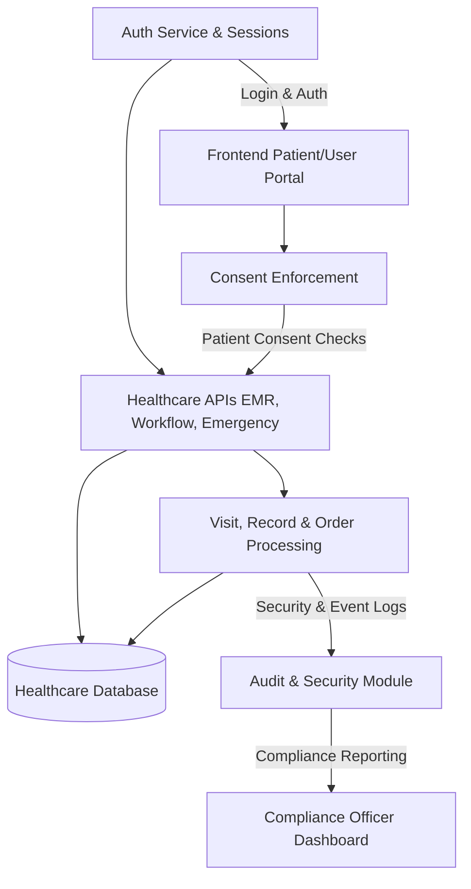

# Secure Healthcare Information & Patient Management System with Regulatory Compliance

> **Problem Complexity: HIGH**

A security-first healthcare platform designed to protect sensitive medical data through patient ownership, consent-driven access, role-based authorization, and fully auditable workflows aligned with GDPR and HIPAA principles.

---

## Overview

Modern healthcare systems manage extremely sensitive data such as diagnoses, prescriptions, laboratory reports, imaging results, and treatment histories. As healthcare services continue to digitize, protecting this data while ensuring controlled accessibility has become a critical engineering challenge.

This project implements a secure healthcare information and patient management system that embeds privacy, security, and regulatory considerations directly into system architecture rather than treating them as external requirements.

The platform models real-world healthcare interactions between patients, doctors, nurses, laboratories, pharmacists, administrators, insurers, and researchers while enforcing strict governance over medical data access.

The system is built on the principle that **trust in healthcare software must be engineered — not assumed.**

---

## System Architecture

The platform follows a secure layered architecture designed to validate every access request before data exposure.



### Directory Structure

```text
Secure_Healthcare_Management_System/
├── backend/
│   ├── src/
│   │   ├── config/
│   │   ├── database/
│   │   ├── jobs/
│   │   ├── middleware/
│   │   │   ├── abac.middleware.js
│   │   │   ├── auth.middleware.js
│   │   │   ├── consent.middleware.js
│   │   │   ├── rbac.middleware.js
│   │   │   └── validation.middleware.js
│   │   ├── models/
│   │   ├── modules/
│   │   │   ├── auth/
│   │   │   ├── consent/
│   │   │   ├── emr/
│   │   │   ├── visit/
│   │   │   └── workflow/
│   │   ├── services/
│   │   │   ├── audit.service.js
│   │   │   ├── encryption.service.js
│   │   │   ├── otp.service.js
│   │   │   └── violation.service.js
│   │   └── app.js
│   └── server.js
├── frontend/
│   ├── src/
│   │   ├── api/
│   │   ├── components/
│   │   │   ├── clinical/ (Lab, Imaging, Prescriptions)
│   │   │   ├── emergency/
│   │   │   └── emr/
│   │   ├── pages/ (Doctor, Nurse, Patient, Lab, Radiology, Admin)
│   │   └── App.js
└── README.md
```

---

## Key Features

### 🛡️ Security & Access Control
- **RBAC & ABAC:** Fine-grained Role-Based and Attribute-Based Access Control.
- **Zero Trust:** Default-deny policy with least-privilege enforcement.
- **Break-Glass Access:** Secure emergency access with mandatory justification and audit alerts.
- **QR Code Check-in:** Secure visitor check-in using QR codes for touchless verification.

### 🔒 Privacy & Consent Governance
- **Patient-Controlled Consent:** Granular control over who can access specific data categories.
- **Purpose-Based Access:** Data access is restricted based on the clinical purpose of the visit.
- **Immediate Revocation:** Patients can revoke consent at any time, instantly locking data.

### 🏥 Clinical Systems
- **EMR Management:** Immutable diagnoses and versioned treatment plans.
- **Digital Prescriptions:** End-to-end pharmacy workflow tracking.
- **AI Health Screening:** Integrated AI Chatbot for preliminary health screening and symptom checking.
- **Lab & Imaging:** Full lifecycle management for medical orders and results.

### 📊 Compliance & Traceability
- **Immutable Audit Logs:** Every data interaction is recorded in a tamper-resistant audit trail.
- **Encryption:** AES-256 encryption for data at rest and TLS 1.3 for data in transit.
- **Regulatory Readiness:** Built-in reporting for HIPAA and GDPR compliance audits.

---

## Tech Stack

- **Frontend:** React, Tailwind CSS (Visual Excellence)
- **Backend:** Node.js, Express.js
- **Database:** PostgreSQL (with Row-Level Security)
- **Security:** JWT, OTP (Multi-Factor), Bcrypt, Crypto.js
- **DevOps:** Docker, Prometheus, Grafana, Trivy (Security Scanning)

---

## Installation & Setup

### Prerequisites

- Node.js v18+
- Docker & Docker Compose v24+
- PostgreSQL v15+ (if running locally)

### Quick Start (Recommended)

```powershell
# 1. Clone and enter the project
git clone <repo-url>
cd Secure_Healthcare_Management_System

# 2. Run the bootstrap script
.\scripts\dev-bootstrap.ps1 -WithTools
```

Once complete, the system is available at:
- **Frontend:** http://localhost:3000
- **Backend API:** http://localhost:5000
- **Grafana Metrics:** http://localhost:3001

---

## Future Roadmap

1.  **AI-Assisted Illness Prediction:** Advanced ML models for early diagnosis.
2.  **Mobile-First Patient App:** Dedicated React Native application for patients.
3.  **FHIR/HL7 Interoperability:** Standardized healthcare data exchange.
4.  **Blockchain-Anchored Audit Trail:** Higher-tier immutability for logs.
5.  **Multi-Factor Authentication:** Support for TOTP and Passkeys (FIDO2).
6.  **Compliance Analytics:** Interactive dashboards for compliance officers.
7.  **Federated Identity:** Integration with hospital-wide SSO systems.
8.  **Patient Data Portability:** Structured data export (JSON/PDF).
9.  **Anomaly Detection:** Real-time AI alerts for suspicious access patterns.
10. **Load Testing Suite:** Automated end-to-end performance validation.

---

## Project Team

- **Chirag Keshav** [CB.SC.U4CSE23014]
- **Devansh Dewan** [CB.SC.U4CSE23017]
- **Harish G M** [CB.SC.U4CSE23027]
- **Harshita R** [CB.SC.U4CSE23028]
- **Sarvanthikha SR** [CB.SC.U4CSE23048]
- **Theegela Vishnu Vardhan** [CB.SC.U4CSE23056]

---
© 2026 Secure Healthcare Management System | Amrita Vishwa Vidyapeetham
