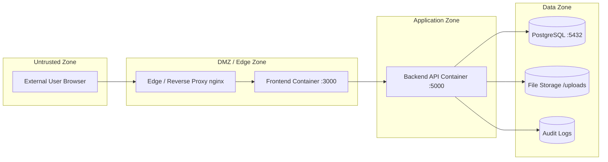

# Threat Model — Secure Healthcare Management System

## Document Control

| Field | Value |
|---|---|
| Version | 1.0 |
| Created | 2026-02-28 |
| Owner | DevOps / Security Engineering |
| Review Cadence | Quarterly or after any architecture change |
| Status | Active |

---

## 1. System Description

The Secure Healthcare Information & Patient Management System is a web application that manages:

- Patient registration, demographics, and visit lifecycle
- Electronic Medical Records (EMR): diagnoses, prescriptions, lab orders/results, imaging
- Staff identity, roles (RBAC), attribute-based access control (ABAC)
- Consent management for data sharing
- Audit logging with hash-chain integrity
- Multi-organization support with staff-org mappings

### Technology Stack

| Component | Technology |
|---|---|
| Frontend | React (CRA), served via nginx in production |
| Backend API | Node.js 20 / Express |
| Database | PostgreSQL 15 |
| Authentication | JWT (access + refresh tokens), bcrypt, WebAuthn/Passkeys |
| Containerization | Docker multi-stage builds, Docker Compose |
| CI | GitHub Actions |

---

## 2. Trust Boundary Diagram

### Trust Boundaries

| Boundary | From | To | Controls |
|---|---|---|---|
| TB-1 | Browser → nginx | Untrusted → DMZ | TLS termination, security headers, rate limiting |
| TB-2 | Frontend → API | DMZ → App Zone | JWT authentication, CORS, input validation |
| TB-3 | API → Database | App Zone → Data Zone | Connection pooling, parameterized queries, least-privilege DB user |
| TB-4 | API → File Storage | App Zone → Data Zone | File type validation, path traversal prevention, size limits |

---

## 3. Assets & Data Classification

| Asset | Classification | CIA Priority | Regulatory |
|---|---|---|---|
| Patient demographics (name, DOB, address, phone) | PII | C > I > A | GDPR Art. 5, HIPAA §164.312 |
| Diagnoses, prescriptions, lab results, imaging | PHI | C > I > A | HIPAA §164.312, GDPR Art. 9 |
| Audit logs (access records, hash chains) | Internal / Compliance | I > A > C | HIPAA §164.312(b), GDPR Art. 30 |
| JWT secrets, encryption keys, DB credentials | Secrets (Tier 1) | C > A > I | Internal policy |
| User credentials (password hashes, passkeys) | PII / Secrets | C > I > A | HIPAA, GDPR |
| Consent records | PHI-adjacent | I > C > A | GDPR Art. 7, HIPAA §164.508 |
| Staff roles, org mappings | Internal | I > C > A | Internal policy |
| Application source code | Internal | I > C > A | Internal policy |

---

## 4. Threat Actors

| Actor | Motivation | Capability | Likelihood |
|---|---|---|---|
| **External attacker** | Data theft, ransomware, disruption | Network attacks, credential stuffing, injection | High |
| **Malicious insider (staff)** | Record snooping, data sale, revenge | Valid credentials, knowledge of system | Medium |
| **Compromised account** | Lateral movement, privilege escalation | Stolen session/JWT, phished credentials | Medium-High |
| **Automated bot** | Credential stuffing, scraping, DDoS | Automated tooling, botnets | High |
| **Supply chain** | Backdoor injection | Compromised dependency or build tool | Low-Medium |

---

## 5. Threat Scenarios (STRIDE Analysis)

### T-01: Insider Record Snooping

| Field | Detail |
|---|---|
| STRIDE Category | Information Disclosure |
| Actor | Malicious insider |
| Attack Path | Authenticated staff queries patient records they have no care relationship with |
| Affected Assets | PHI (diagnoses, prescriptions, lab results) |
| Existing Controls | RBAC middleware, ABAC policy engine, consent checks |
| Gaps | No anomaly detection for excessive reads per actor |
| Risk Level | **High** |
| Recommended Controls | Per-actor access rate monitoring, care-team scope enforcement, alerting on unusual query patterns |

### T-02: Privilege Escalation

| Field | Detail |
|---|---|
| STRIDE Category | Elevation of Privilege |
| Actor | Compromised account, malicious insider |
| Attack Path | Attacker modifies their role or exploits RBAC/ABAC bypass to gain admin/doctor privileges |
| Affected Assets | All system data, configuration |
| Existing Controls | Role validation middleware, JWT role claims |
| Gaps | No role-change audit alerting, no approval workflow for privilege changes |
| Risk Level | **Critical** |
| Recommended Controls | Role change requires admin approval + audit alert, MFA for privilege changes, role assignment only during change windows |

### T-03: SQL / Command Injection

| Field | Detail |
|---|---|
| STRIDE Category | Tampering, Information Disclosure |
| Actor | External attacker |
| Attack Path | Malicious input in API parameters bypasses validation and executes arbitrary SQL or OS commands |
| Affected Assets | Database (all data), server integrity |
| Existing Controls | Parameterized queries (pg Pool), input validation, helmet headers |
| Gaps | No WAF, no automated DAST scanning |
| Risk Level | **High** |
| Recommended Controls | WAF deployment, DAST in CI/CD, strict input schema validation (Joi/Zod) |

### T-04: Data Exfiltration (Bulk Query Abuse)

| Field | Detail |
|---|---|
| STRIDE Category | Information Disclosure |
| Actor | Compromised account, malicious insider |
| Attack Path | Legitimate user exports or queries large volumes of patient data beyond operational need |
| Affected Assets | PHI, PII |
| Existing Controls | Pagination in API responses, role-scoped queries |
| Gaps | No export volume limits, no DLP alerting on bulk access |
| Risk Level | **Critical** |
| Recommended Controls | Export rate limits, row-count alerting thresholds, download audit logging |

### T-05: Consent Bypass / Override Abuse

| Field | Detail |
|---|---|
| STRIDE Category | Tampering, Elevation of Privilege |
| Actor | Malicious insider, compromised account |
| Attack Path | Accessing PHI without valid consent or abusing emergency override mechanism |
| Affected Assets | PHI, consent integrity |
| Existing Controls | Consent middleware, emergency access with duration limits |
| Gaps | Emergency override post-use review not automated |
| Risk Level | **Critical** |
| Recommended Controls | Mandatory post-emergency review workflow, consent audit alerts, override usage dashboard |

### T-06: Session Hijacking / JWT Theft

| Field | Detail |
|---|---|
| STRIDE Category | Spoofing |
| Actor | External attacker |
| Attack Path | XSS or network interception steals JWT from client, used to impersonate user |
| Affected Assets | User sessions, PHI access |
| Existing Controls | HttpOnly cookies (if used), JWT expiry, refresh token rotation |
| Gaps | JWT stored in localStorage (XSS risk), no token binding to IP/fingerprint |
| Risk Level | **High** |
| Recommended Controls | Move JWT to HttpOnly secure cookies, CSP headers, token fingerprinting |

### T-07: Denial of Service

| Field | Detail |
|---|---|
| STRIDE Category | Denial of Service |
| Actor | External attacker, automated bot |
| Attack Path | Flooding API endpoints or login/OTP endpoints to exhaust resources |
| Affected Assets | System availability |
| Existing Controls | express-rate-limit (global, login, OTP), healthcheck endpoints |
| Gaps | No infrastructure-level DDoS protection, no adaptive rate limiting |
| Risk Level | **Medium** |
| Recommended Controls | Cloud WAF/DDoS protection, adaptive rate limits, circuit breakers |

### T-08: Supply Chain Compromise

| Field | Detail |
|---|---|
| STRIDE Category | Tampering |
| Actor | Supply chain attacker |
| Attack Path | Compromised npm dependency introduces backdoor in build artifact |
| Affected Assets | Application integrity, all data |
| Existing Controls | npm audit in CI, lockfile-based installs |
| Gaps | No SBOM, no image signing, no dependency pinning verification |
| Risk Level | **Medium** |
| Recommended Controls | SBOM generation, image signing, dependency review automation, Snyk/Trivy scanning |

---

## 6. Risk Summary Matrix

| ID | Threat | Likelihood | Impact | Risk | Priority |
|---|---|---|---|---|---|
| T-01 | Insider snooping | Medium | High | **High** | P1 |
| T-02 | Privilege escalation | Medium | Critical | **Critical** | P0 |
| T-03 | Injection | Medium | High | **High** | P1 |
| T-04 | Data exfiltration | Medium | Critical | **Critical** | P0 |
| T-05 | Consent bypass | Low-Medium | Critical | **High** | P1 |
| T-06 | Session hijacking | Medium | High | **High** | P1 |
| T-07 | Denial of service | High | Medium | **Medium** | P2 |
| T-08 | Supply chain | Low | High | **Medium** | P2 |

---

## 7. Control Traceability

Each DevOps phase maps back to threats mitigated:

| Phase | Threats Addressed |
|---|---|
| Phase 1 — Local Hardening | T-03 (deterministic env), T-06 (secure defaults) |
| Phase 2 — CI Integrity | T-08 (build verification), T-03 (test gates) |
| Phase 3 — Supply Chain | T-08 (SBOM, scanning, signing) |
| Phase 4 — Runtime Hardening | T-02 (least privilege), T-04 (resource limits), T-07 (isolation) |
| Phase 5 — Zero Trust | T-01 (network segmentation), T-02 (service auth), T-04 (data zone isolation) |
| Phase 6 — Secrets Governance | T-02 (key rotation), T-06 (secret lifecycle) |
| Phase 7 — CD Policy Gate | T-08 (signed artifacts), T-02 (approval gates) |
| Phase 8 — Security Observability | T-01 (access alerts), T-02 (privilege alerts), T-04 (exfil detection), T-05 (consent alerts) |
| Phase 9 — Data Governance | T-04 (retention controls), T-05 (consent integrity) |
| Phase 10 — Migration Rules | T-03 (schema safety), T-07 (availability) |
| Phase 11 — Access Governance | T-01 (access reviews), T-02 (privilege audits) |
| Phase 12 — Backup/DR | T-07 (recovery), T-04 (backup integrity) |

---

## 8. Review & Update Triggers

This threat model must be reviewed when:

1. New service or data store is added to the architecture
2. Authentication/authorization model changes
3. New external integration is introduced
4. Security incident occurs
5. Quarterly review cycle (minimum)
6. Regulatory requirement changes

---

## Approval

| Role | Name | Date | Signature |
|---|---|---|---|
| DevOps Lead | | | |
| Security Lead | | | |
| Backend Lead | | | |
